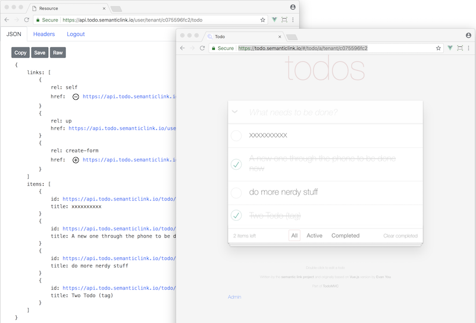
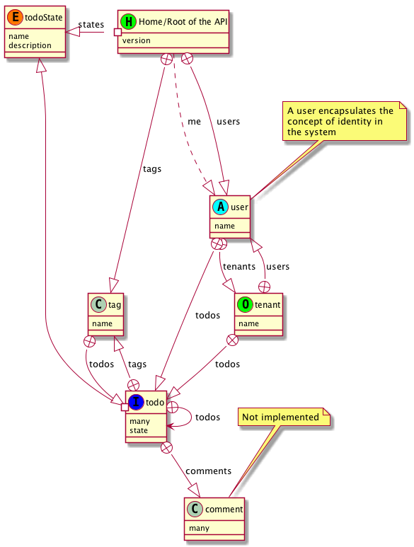

This is the sample implementations of clients and API for [How to Hypermedia](https://howtohypermedia.semanticlink.io).



### 1. clone the respository

`git clone https://github.com/semanticlink/todo-hypermedia/`

### 2. Startup the [API](https://github.com/semanticlink/todo-hypermedia/api) and the [client](https://github.com/semanticlink/todo-hypermedia/client)

```bash
.
├── api    (AspNet Core)
│   └── Readme.md
└── client   (javascript multiple clients)
    └── readme.md

```
        
## Client

- Vue over the API as a browser
- Vue as a rich user interaction

## API

- C#/ASP.NET Core (for serverless)



# Demo

* [Demo site](https://todo.semanticlink.io) (test-1@semanticlink.io:1234qwerZXCV)

# Tutorial

* [How to Hypermedia](https://howtohypermedia.semanticlink.io)
